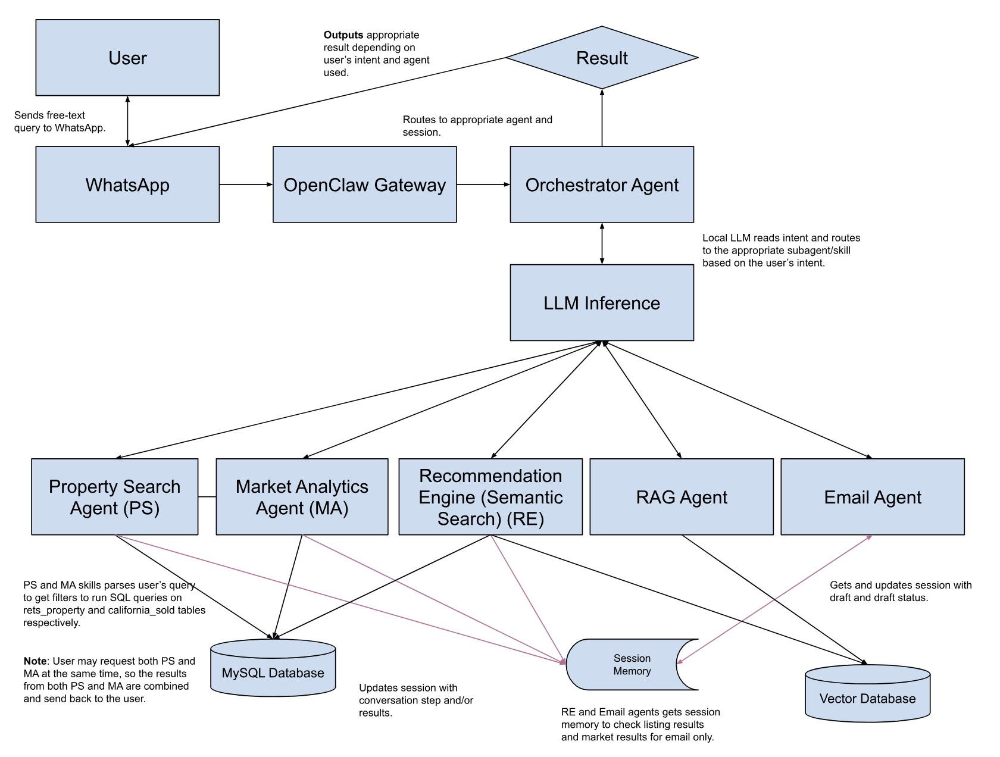

# IDX Multi-Agentic Real Estate AI Agent

Built and design a production multi-agent AI assistant for real estate listing using MLS data for the IDX Exchange 12-week NLP internship. 
Powered by OpenClaw, WhatsApp, and Ollama A user is able to send free-text queries via WhatsApp, letting OpenClaw and Ollama query the user's intent to route it the approriate sub-agent.

This Agentic AI is capable of doing the following:
- Real-time MLS property search and market analytics over real-world MLS records (rets_property + california_sold)
- Conversation session memory, remembers conversation steps, last listing and property results, and draft + draft status.
- Semantic + recommendation Engine to perform a search for semantic similarly listings and validating these listings using sold comps.
- Retrieval augmented generation to answer relevant real estate questions, grounded by documents in the vector database.
- Email draft-and-approve functionality for property and market listings. Shows draft first before explicit approval by user.

# Architecture Diagram

# Backup Demo Videos
- [Architecture Diagram](https://www.youtube.com/watch?v=VumxzKd-ntA)
- [Coding Implementation](https://www.youtube.com/watch?v=vZGsuPGMw-E)
- [Testing Suite](https://www.youtube.com/watch?v=8Z85XhEwEks)
- [WhatsApp Demo](https://www.youtube.com/watch?v=arpq5C3C_Sk)

# Tools & Frameworks used
- Python
- Typescript/Javascript
- OpenClaw
- Gemma 4 (Primary Agent) and Llama 3.2 (Sub-agents) (Ollama)
- EmbeddingGemma
- ChromaDB
- MySQL
- LangChain
- Nodemailer

# Progress
- Week 0 - Successfully setup Openclaw and integrated into WhatsApp. Results can be seen in the week-0 folder. Additionally, I was able to successfully setup the MySQL Database and import both datasets into the database.
- Week 1 - Devised and documentated workflow diagram of how user queries flow from WhatsApp through OpenClaw skills to MLS diagram. Successfully ran test skill using test tool provided in handbook.
- Week 2 - Built and successfully test NLP Parser against 20 test queries. Was able to successfully get a NLP Parser response back from the Agent via WhatsApp.
- Week 3 - Built a functional MLS Search that accepts NLP filter objects from Week 2, queries rets_property and/or california_sold, and returns formatted property cards.
- Week 4 - Build a functional conversational property search agent, where the agent ask follow-up questions, remembers preferences in sessions, refines search query, and returns rets_property results with address, price, beds/baths, and photo count.
- Week 5 - Built a market analytics engine that answers questions such as "Is now a good time to buy in San Diego?" or "What is the average price per sq ft in Pasadena?" by sending SQL queries to california_sold table via Python and returns data-backed summaries with median price, DOM, list-to-close ratio, and month-to-month trend for any California city.
- Week 6 - Built a semantic search agent that use EmbeddingGemma to find semantically similar properties, such that a query like "charming craftsman with mountain views and character" matches relevant listings even without exact keyword overlap. Additionally, ChromaDB is used to index store the embeddings for fast retrieval and similarity search.
- Week 7 - Built recommendation engine that recommends the top 5 similar active listings with a comp-validated price assessment sourced from california_sold data using a hybrid scoring that combines structured similarity scoring with semantic similarity. Also, updated vector database implementation to ingest all embedded rets_property data via batching. 
- Week 8 - Built a document-aware RAG assistant that can answer questions about real estate concepts, MLS field definitions, and market terminology — grounding its answers in authoritative source documents.
- Week 9 - Built a single intelligent coordinator that analyzes each incoming query and routes to a approripate agent or splits it across multiple agents to produce a comprehensive, unifed response.
- Week 10 - Built end-to-end WhatsApp assistant handling, property search, market questions, recommendations, RAG, and mixed intent with clean formatted questions.
- Week 11 - Built an email agent for listing alerts, market reports, and property summaries with strict human-approval guardrails so no email is ever sent autonomously without explicit confirmation.
- Week 12 - Drawn final architecture diagram, written schema annotation and project reflection and recorded backup demo videos.